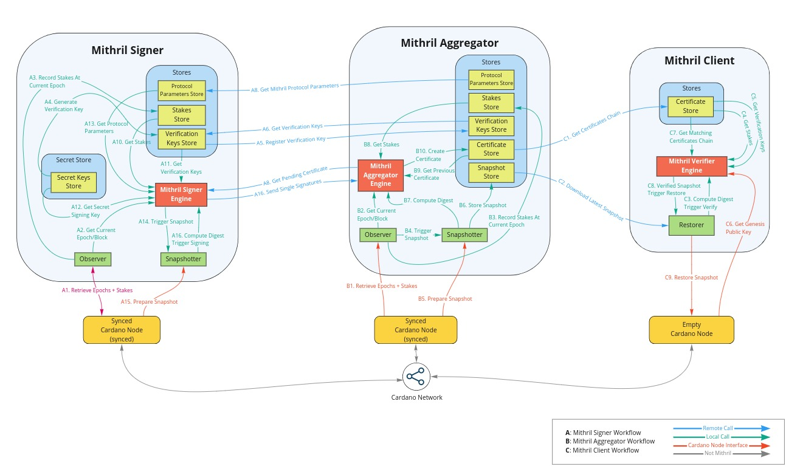

# Mithril network architecture

:::tip

For more information about the Mithril protocol, read [about Mithril](../mithril-protocol/protocol.md).

:::

## Introduction

Currently, the Mithril network operates as a collection of nodes responsible for generating snapshots and certificates, facilitating the fast bootstrapping of a Cardano node. This network functions on top of the Cardano network.

:::info

The role of a Mithril network is to enable end users to restore a full Cardano node in less than two hours.

:::

The network is composed of three nodes:

* [**Mithril aggregator**](./aggregator.md):

> The trustless node that orchestrates the work of the Mithril signer nodes, gathering their individual signatures to produce Mithril multi-signatures and their associated certificates. The aggregator is also in charge of creating and storing the ledger state snapshot archive.

* [**Mithril signer**](./signer.md):

> The node that works transparently on top of the stake pool operator's Cardano node and individually signs the ledger state.

* [**Mithril client**](./client.md):

> The node used to restore a Cardano full node by retrieving a remote snapshot and its certificate chain from a Mithril aggregator. It then employs Mithril cryptographic primitives to verify their authenticity and validity.

## Architecture overview

:::info

* This document is subject to change as it is a work in progress.
* The team is currently working on further decentralizing the network architecture.

:::

